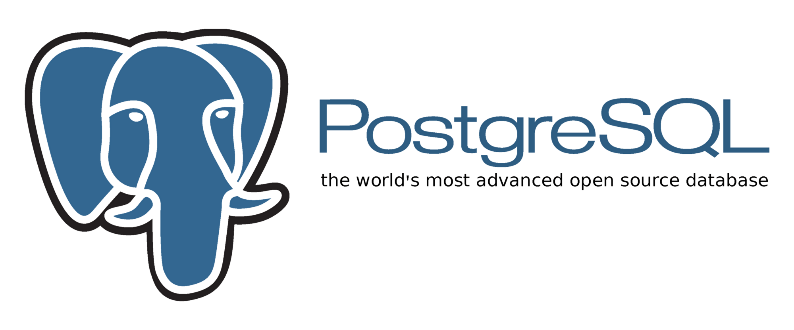

# Dependencies  (依赖)

## Bash Scripts Dependencies  (Bash 脚本依赖)

**Recommended way:** executing bash script: `./libs/resolve.sh`   
**推荐方式:** 执行 Bash 脚本: `./libs/resolve.sh`

~~Manual Install: (手动安装)~~

1. **gdrive** (Google Drive CLI Client)
	- Install `gdrive-***-***` as `./libs/gdrive`
		- <https://github.com/prasmussen/gdrive#downloads>
	- `chmod +x ./libs/gdrive`
2. **jq** (Command-line JSON processor)
	- Install `jq` via package management, for example: `apt install jq`, `brew install jq`, ...

---

## MongoDB Dependencies  (MongoDB 数据库相关依赖)

You can install `mongodb-org` (all in one package), or install `mongodb-org-tools` at minimal. (include `mongodump` cli tools)   
至少安装 `mongodb-org-tools` 包, (内含 `mongodump` 命令行工具)

Install Guide (安装教程): <https://docs.mongodb.com/manual/administration/install-on-linux/>

Example install on Ubuntu (Ubuntu上的样例安装):

> 1. Import the public key used by the package management system. 
> 2. Create a list file for MongoDB.
> 3. `sudo apt update`
> 4. `sudo apt install -y mongodb-org-tools`
>
> From: <https://docs.mongodb.com/manual/tutorial/install-mongodb-on-ubuntu/>

---

## PostgreSQL Dependencies  (PostgreSQL 数据库相关依赖)

You can install `postgresql-10` (all in one package), or install `postgresql-client-10` at minimal.   
至少安装 `postgresql-client-10` 包, (内含 `pg_dump` 命令行工具)

Install Guide (安装教程): <https://www.postgresql.org/download/>

Example install on Ubuntu (Ubuntu上的样例安装):

> 1. Import the public key used by the package management system. 
> 2. Create a list file for PostgreSQL.
>    - `deb http://apt.postgresql.org/pub/repos/apt/ bionic-pgdg main`
> 3. `sudo apt update`
> 4. `sudo apt install -y postgresql-client-10`
>
> From: <https://www.postgresql.org/download/linux/ubuntu/>
