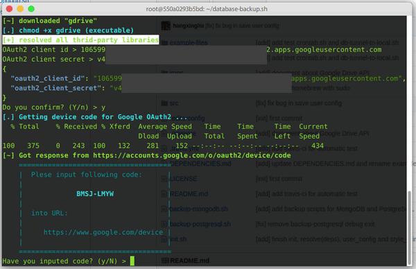
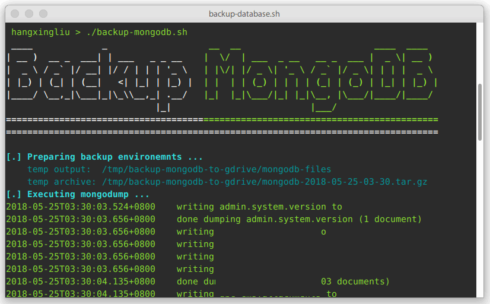

# Backup Database Scripts  数据库备份脚本

[](https://travis-ci.org/hangxingliu/database-backup.sh)

:floppy_disk: A Bash script for backup database to Google Drive.    
一个用于备份数据库到 Google Drive 的 Bash 脚本.

## Links 链接

- [Dependencis 依赖](DEPENDENCIES.md)
- [About (关于) Google Drive API](for-developer/GOOGLE-DRIVE-API.md)

## Support 支持

Database supported:

- MongoDB: `mongodump` 
- PostgreSQL: `pg_dump`

You can easily create a new database backup script based on `backup-mongodb.sh`.   
(你可以基于 `backup-mongodb.sh` 轻松地创建一个新的数据库备份脚本)

## Install & Usage 安装 & 使用

### 0x00. Git clone this repository

``` bash
git clone https://github.com/hangxingliu/database-backup.sh.git
```

### 0x01. Install database command line tools you need

安装你所需要的数据库的命令行工具

What command line tools you need install?    
You can read this document: [DEPENDENCIES.md](DEPENDENCIES.md)   
For example, if you need to backup MongoDB, you should install `mongodb-org-tools` package for `mongodump` tools.

不知道要装什么? 参考一下这篇文档: [DEPENDENCIES.md](DEPENDENCIES.md)    
比如说, 如果你需要备份 MongoDB 的数据库, 那你需要安装 `mongodb-org-tools` 这个包, 因为里面包含备份工具 `mongodump`.

### 0x02. Get Google OAtuth2 Id and secret 

Get Google OAuth2 Id and secret for operate Google Drive by API.   
为了能正常地操作 Google Drive, 你需要先创建获得 Google OAuth2 Id 和 secret.

Graphic guidance 图文指导:

Just read section: (查看下面这个章节即可):   
**"How to get OAuth2 client id and secret for Google Drive API"**

[GOOGLE-DRIVE-API.md](for-developer/GOOGLE-DRIVE-API.md)

### 0x03. Initialize backup environment and dependencies

初始化备份环境和依赖文件:

``` bash
# init.sh is used for:
#  1. resolve all dependencies scripts need.
#  2. authroize a Google Drive account and storage its access token in the local
./init.sh

# then input your OAuth2 id and secret  
# input code be displayed on screen in https://www.google.com/device

# 然后输入你的 OAuth2 id 和 secret
# 然后去 https://www.google.com/device 输入屏幕上的验证码
```

   
   


### 0x04. Backup

Just execute bash scripts `./backup-xxx.sh`, for example:   
执行 bash 脚本 `./backup-xxx.sh` 即可, 例如:

``` bash
./backup-mongodb.sh
./backup-postgresql.sh --database dbTest
# you could find detailed reference of backup script 
#     in the front of itself.
# 你能在在备份脚本的头部找到详细的参考
```

   

### 0x05. (Optional) Add backup into crontab

添加备份到 crontab 定时任务可以参考样例脚本文件:   
[example-files/crontab.sh](example-files/crontab.sh)

You can reference the example crontab bash script:    
[example-files/crontab.sh](example-files/crontab.sh)

And modify it for yourself, then add rule into crontab 
(`crontab -e`), for example: 

``` bash
# backup everyday 每天备份一次
0 0 * * * /path/to/backup-database.sh/crontab.sh
```

## TODO

- [ ] `./init.sh`: choose special directory
- [ ] more documents about `backup-mysql.sh`

## Third-party libraries 

- **gdrive** (Google Drive CLI Client)
	- <https://github.com/prasmussen/gdrive>
- **jq** (Command-line JSON processor)
	- <https://stedolan.github.io/jq>
- **cURL** (cURL is used in command lines or scripts to transfer data)
	- <https://github.com/curl/curl>

## Author

[Liu Yue @hangxingliu](https://github.com/hangxingliu)

## License

[GPL-3.0](LICENSE)
