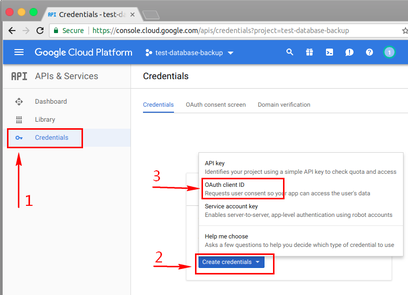

# About Google Drive API 关于 Google Drive API

[Google Drive API v3 Document (官方文档)](https://developers.google.com/drive/api/v3/about-sdk)

## Overview 概述

The latest version of Google drive API is v3 util I wrote this document.   
And it uses [OAuth2][oauth2] as its authorization protocol.

到这个文档为止, Google Drive 的最新API版本为 v3. 它使用 [OAuth2][oauth2] 作为 API 验证协议.

> OAuth 2.0 is the industry-standard protocol for authorization

### OAuth2

- Offical document: <https://oauth.net/2/>
- 阮一峰的博客: <http://www.ruanyifeng.com/blog/2014/05/oauth_2_0.html>

### How this script uses OAuth2 这个备份脚本是如何使用 OAuth2 的?

Because this script is be used in terminal or as a crontab task, so it has a little incompatible with the general web OAuth2 flow.

And then I found Google provides a better way for this condition (UI/Input limited condition):
*[OAuth 2.0 for TV and Limited-Input Device Applications][oauth2_for_device]*

**IMPORTANT:** This way only supported limited scopes:   
<https://developers.google.com/identity/protocols/OAuth2ForDevices#allowedscopes>

So the script uses this way, and its flows:

0. User execute `init.sh` for initialize backup environment.
1. Script requests a `device_code` and `user_code` from Google.
2. Script prompts user input `user_code` into <https://www.google.com/device> and confirm authoriztion on browser.
3. Script gets `access_token` and `refresh_token` from Google by `device_code`.
4. Script operates Google Drive by `access_token`.
5. And script get latest `access_token` by `refresh_token`.

Flow image (*from Google API document*):


因为这个备份脚本主要是在终端使用或者被作为一个 crontab 任务, 所以一般的 Web OAuth2 验证流程不是很合适用在其中.

然后我发现 Google 为这种情况 (不方便输入或展示UI界面的情况) 提供了一种不错的验证方式: 
*[给 TV/输入被限制设备上 App 使用的 OAuth 2.0 ][oauth2_for_device]*

**注意:** 这种方式限制了授权的 scope:   
<https://developers.google.com/identity/protocols/OAuth2ForDevices#allowedscopes>

所以此脚本使用了这种方式, 然后流程如下:

0. 用户执行 `init.sh` 来初始化备份环境.
1. 脚本从Google请求 `device_code` 和 `user_code`.
2. 脚本提示用户在浏览器中打开 <https://www.google.com/device>, 并输入 `user_code` 以及确认授权.
3. 脚本通过 `device_code` 从 Google 获取可以用于操作 API 的 `access_token` 和 `refresh_token`.
4. 脚本使用 `access_token` 访问 Google Drive API.
5. 然后脚本通过 `refresh_token` 刷新 `access_token`.


## Google Drive API

Before this section, I want to quote a sentence from StackOverflow:

> If you want to save yourself an afternoon of pain, forget google's doumentation and head over here.
>
> <https://stackoverflow.com/questions/28593022/list-google-drive-files-with-curl/28596114>

And I found it is so difficult to diving at Google API documents and found somethings you want, so I list some tips and steps to operate Google Drive by API/cli tools. (following sections starts with :star:  )

我发现阅读 Google 庞大的 API 文档还是需要不少时间和精力, 下面放入一些关于通过 API/命令行工具 访问 Google Drive 的心得 (下列带有 :star: 的章节)


<div style="text-align:center;color:#555;font-size:1.4em;margin-top:4em">
	Inspiration 心得
</div>

## :star: How to get OAuth2 client id and secret for Google Drive API

这个章节: 如何获得 OAuth2 client id 和 OAuth2 client secret 来访问 Google Drive API

Firstly, Visit Google Cloud Platform: (首先访问 Google 云平台)

Goto <https://console.cloud.google.com/apis> and login.

### 0x01. A project on Google Cloud Platform

0x01. 请先确保你在 Google 云平台上有一个 Project


### 0x02. Enable Google Drive API

0x02. 启用 Google Drive API


### 0x03. Config OAuth2

0x03. 配置 OAuth2





## :star: How to authorize by OAuth2 in terminal

This section is about how to get `Access Token` (token for Google Drive API) and `Refresh Token` (token for update access token) by `OAuth2 Client ID` and `OAuth2 Client Secret` you got them be before section.

这个章节是说如何使用前一个章节拿到的 `OAuth2 Client ID` 和 `OAuth2 Client Secret` 来换取 `Access Token` 和 `Refresh Token` 以便操作 Google Drive API.

### 0x01. Get `device_code` and `user_code`, guide user to authorize in browser

获取 `device_code` 和 `user_code`, 引导用户通过浏览器授权

``` bash
# Request 请求样例
URL="https://accounts.google.com/o/oauth2/device/code";
CLIENT_ID="45...-7f....apps.googleusercontent.com";
SCOPE="https://www.googleapis.com/auth/drive.file";

curl -X POST --data "client_id=$CLIENT_ID&scope=$SCOPE" $URL;
```

Response: (响应)
``` json
{
  "device_code": "AH-1Ng30i...",
  "user_code": "HEYY-NICE",
  "expires_in": 1800,
  "interval": 5,
  "verification_url": "https://www.google.com/device"
}
```

And display some information, guide user visit <https://www.google.com/device>, and input the `user_code` in response (`HEYY-NICE` in here).

引导用户前往 <https://www.google.com/device> 并输入 `user_code` (这里是: `HEYY-NICE`)

### 0x02. Get `access_token` and `refresh_token` after user authrized.

在用户授权后获得 `access_token` (有效期: 一般1个小时) 和 `refresh_token` (有效期: 直到用户取消授权).

``` bash
# Request 请求样例
URL="https://accounts.google.com/o/oauth2/token";
CLIENT_ID="45...-7f....apps.googleusercontent.com";
SECRET="2w1UD....";
# You got it from last request:
CODE="AH-1Ng30i..."; 
TYPE="http://oauth.net/grant_type/device/1.0";

curl -X POST --data "client_id=${CLIENT_ID}&client_secret=${SECRET}&code=${CODE}&grant_type=${TYPE}" $URL;
```

Response: (响应)

``` json
{
  "access_token" : "ya29.GlvE....",
  "expires_in" : 3600,
  "refresh_token" : "1/b_J7NDZ-r....",
  "token_type" : "Bearer"
}
```

### 0x03. Refresh `access_token` by `refresh_token`

通过 `refresh_token` (有效期: 直到用户取消授权) 刷新 `access_token`.

``` bash
# Request 请求样例
URL="https://accounts.google.com/o/oauth2/token";
CLIENT_ID="45...-7f....apps.googleusercontent.com";
SECRET="2w1UD....";
# You got it from last request:
REFRESH_TOKEN="1/b_J7NDZ-r...."; 

curl -X POST --data "client_id=${CLIENT_ID}&client_secret=${SECRET}&refresh_token=${REFRESH_TOKEN}&grant_type=refresh_token" $URL;
```

Response: (响应)

``` json
{
  "access_token" : "ya29.Glv...",
  "expires_in" : 3600,
  "token_type" : "Bearer"
}
```

## :star: How to use Google Drive API by cURL

**I don't recommend re-inventing the wheel**, but you can understand how to use API by `access_token` in this section.

**我不推荐重复制造轮子**, 但是你能通过这章了解到如何使用 `access_token` 访问API.

API Reference (参考文档):   
<https://developers.google.com/drive/api/v3/reference/>

Example, create a directory with name `test-directory`: (样例: 创建目录)
``` bash
ACCESS_TOKEN="ya29.GlvE....";
URL="https://www.googleapis.com/drive/v3/files";

curl -X POST --header "Authorization: Bearer $ACCESS_TOKEN" \
	--header "Content-Type: application/json" \
	--data '{"name": "test-directory", "mimeType": "application/vnd.google-apps.folder" }' \
	$URL;
```

Response: (响应)
``` json
{
 "kind": "drive#file",
 "id": "18sEIb...",
 "name": "test-directory",
 "mimeType": "application/vnd.google-apps.folder"
}
```


## :star: Operate Google Drive by `gdrive`

A brilliant single file command line utils, Github repo:   
一个非常不错的单文件命令行工具:   
<https://github.com/prasmussen/gdrive>

You can download `gdrive-xxx-xxx` on its Github repo (你可以在它的 Github 仓库上下载到这个工具的文件)

``` bash
# example usage 样例使用
chmod +x ./gdrive-linux-x64

./gdrive-linux-x64 mkdir test-directory # It will prompt you authrize
./gdrive-linux-x64 --access-token "ya29.GlvEUgcQF..." mkdir test-directory;
./gdrive-linux-x64 --refresh-token "1/b_J7NDZ-rz..." mkdir test-directory;

# more help 更多使用
./gdrive-linux-x64 help
./gdrive-linux-x64 help mkdir
```

## :star: Operate Google Drive by other programming language

使用别的编程语言操作 Google Drive

Offical library refrence (官方轮子参考):   
<https://developers.google.com/drive/api/v3/quickstart/python>


[oauth2]: https://oauth.net/2/
[oauth2_for_device]: https://developers.google.com/identity/protocols/OAuth2ForDevices
